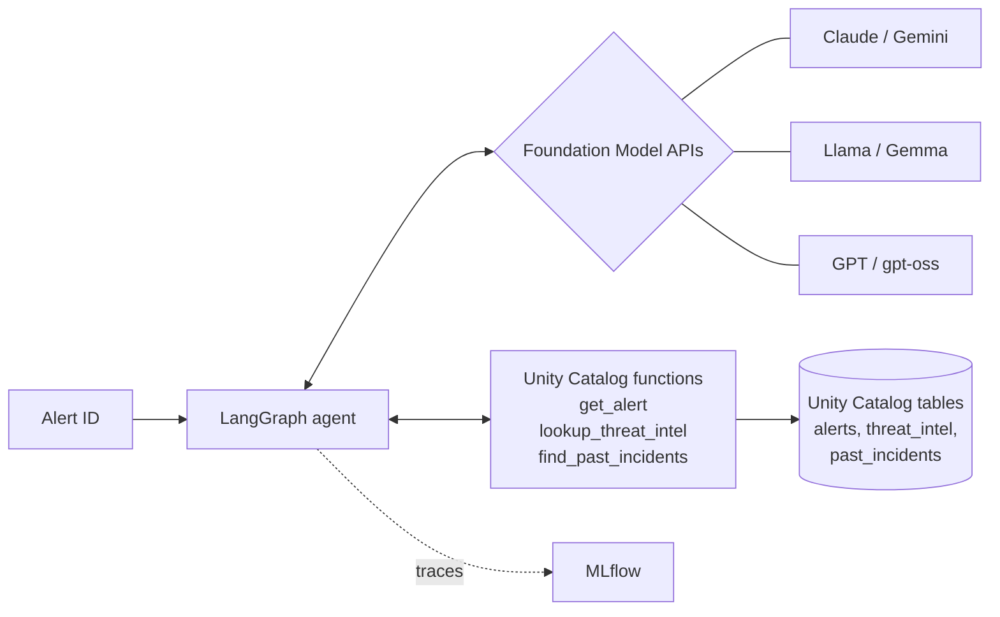

# Multi-Model SOC Triage Agent on Databricks

At work I built a SOC alert triage agent that ran on AWS Bedrock. This is a rebuild of the same idea on Databricks. I wanted to see two things:

1. What changes when the data, tools, and evaluation all live in one platform
2. How different models handle the same triage task when everything else stays the same

The agent gets an alert ID, reads the alert, checks the indicator against threat intel, looks at how similar alerts were handled before, and returns a verdict: `TRUE_POSITIVE`, `FALSE_POSITIVE`, or `NEEDS_ESCALATION`.

## How it's put together

The alerts, threat intel, and past incidents are Unity Catalog tables.

Each tool is a SQL function in Unity Catalog. I went this way so tool access is controlled with `GRANT EXECUTE` like any other asset, and the tools can only read data, never change it. The function's COMMENT is what the model sees as the tool description, so I wrote those for the model rather than for people.

The models come from Foundation Model APIs. The agent code is the same for every model; only the endpoint name changes.

MLflow does two jobs. Autologging traces every model call and tool call inside each run, and each model gets its own MLflow run with accuracy, latency, and tool call counts so they can be compared side by side.

The expected verdicts sit in a separate `alert_labels` table that the agent has no tool for, so it can't see the answers it's scored on.

## Test alerts

Six synthetic alerts. Most are simple lookups, but a couple are there to see how the models reason:

| Alert | Type | What it checks |
|---|---|---|
| A-1001 | Outbound C2 connection | Indicator is known malicious |
| A-1002 | Impossible travel | Login actually came through the corporate VPN |
| A-1003 | SSH brute force | Past cases went both ways. The successful login is what makes it real |
| A-1004 | Malware hash | File is an allowlisted internal tool |
| A-1005 | Data exfiltration | No intel and mixed history. Should escalate, not guess |
| A-1006 | Suspicious DNS | Newly registered phishing lookalike |

IPs are from the RFC 5737 documentation ranges and domains use `.example`, so nothing points at real infrastructure.

## Running it

1. In your Databricks workspace, go to Home, then ⋮ → Import → File, and upload `soc_triage_agent_lab.py`. It opens as a notebook with separate cells. (Importing into the top-level Workspace folder doesn't work, and pasting the file into one cell breaks the pip install step.)
2. Attach serverless compute and Run all.

The notebook checks which model endpoints your workspace can actually use and skips the rest, so there's nothing to configure. It took about 10 minutes for me.

Free Edition works, but it doesn't expose Claude or Gemini. Use a trial workspace if you want those in the comparison.

A couple of things I hit along the way:
- Databricks SQL functions need an aggregate around a correlated subquery, even when it only returns one row, so `get_alert` wraps its result in `MAX()`.
- The preinstalled LangGraph on Databricks clashed with the upgraded version when importing `ToolNode`, so the tool loop is written by hand. It's only a few lines and it's easier to follow anyway.

## Results

I ran this on Free Edition, so this compares the models it exposes: gpt-oss, Llama, and Gemma.

| Model | Endpoint | Accuracy | Avg latency (s) | Avg tool calls |
|---|---|---|---|---|
| Google Gemma | databricks-gemma-3-12b | 100% (6/6) | 7.2 | 3.0 |
| Meta Llama | databricks-meta-llama-3-3-70b-instruct | 100% (6/6) | 8.0 | 3.0 |
| OpenAI (open-weight) | databricks-gpt-oss-120b | 83% (5/6) | 8.3 | 3.0 |

What stood out to me:

The only miss came from the largest model, on the alert designed to catch guessing. On A-1005 (no threat intel, mixed incident history), gpt-oss-120b called it TRUE_POSITIVE instead of escalating. Llama and Gemma both escalated.

The smallest model did best. Gemma 3 12B got everything right and was the fastest.

Every model followed the same path. All 18 runs made exactly 3 tool calls in the expected order, so the tool descriptions and the prompt held up across models.

The traces show real reasoning, not just lookups. On A-1003, gpt-oss didn't stop at the malicious threat intel. It compared the two past SSH brute force incidents, one false positive (failed attempts only) and one true positive (failures followed by a successful login), and matched the alert to the true positive because of the successful root login.

I left token counts out of the table. Each model uses a different tokenizer and prompt template, so the numbers aren't really comparable.

Six alerts is a small set, so I'd read this as a working evaluation setup more than a model ranking. One thing I'd fix in the test data: A-1003's source IP is in threat intel, so a model can get it right from the intel alone. Taking it out would make the incident history the only way to get the right answer.

## What I'd add next

- Deploy it with Mosaic AI Agent Framework and use the Review App to collect analyst feedback
- AI Gateway rate limits and guardrails on the model endpoints
- Replace `find_past_incidents` with Vector Search over free-text incident reports
- More alerts, plus MLflow LLM judges to score the reasoning and not just the verdict
- Rerun on a trial workspace with Claude and Gemini

## Stack

Unity Catalog, Foundation Model APIs, MLflow Tracing, LangGraph, databricks-langchain, Python
