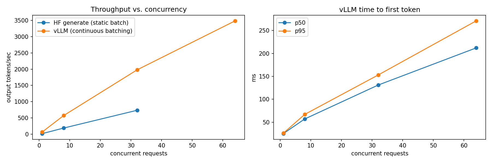
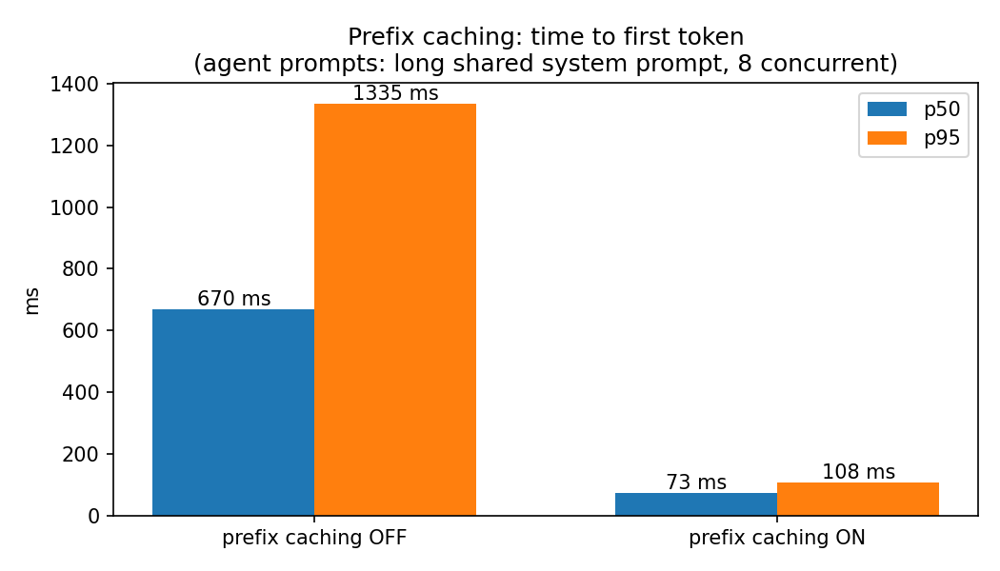
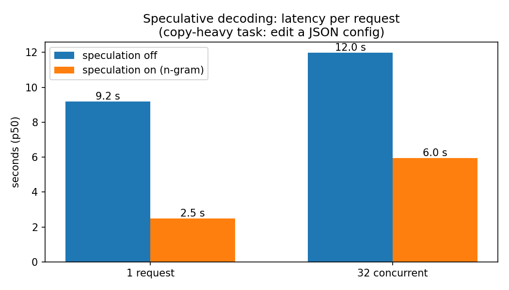
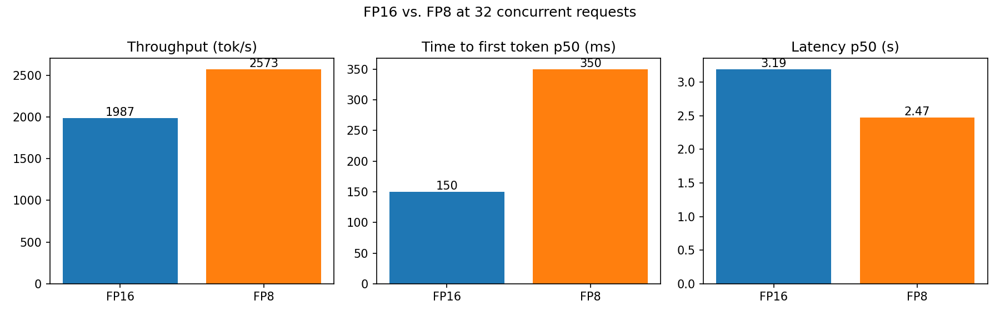

# vLLM Inference Lab: what the optimizations actually buy you

Hands-on results from running vLLM's serving optimizations on one Colab L4 GPU, with `Qwen/Qwen2.5-1.5B-Instruct`. Each section below has what I expected going in, and what the numbers actually showed.

## 1. Continuous batching

**Idea:** a naive server waits for a whole batch to finish before starting the next one. vLLM schedules per token, so a finished request's slot goes straight to a waiting one.

| Engine | Concurrency | Output tok/s |
|---|---|---|
| HF generate (static batch) | 1 | 19.3 |
| HF generate (static batch) | 8 | 189.8 |
| HF generate (static batch) | 32 | 736.5 |
| vLLM (continuous batching) | 1 | 68.9 |
| vLLM (continuous batching) | 8 | 574.1 |
| vLLM (continuous batching) | 32 | 1979.1 |
| vLLM (continuous batching) | 64 | 3483.6 |

vLLM was already ~3.5x faster than plain HF `generate()` at concurrency 1, and stayed roughly 3x ahead as load went up. It also kept scaling cleanly out to 64 concurrent requests, well past where the HF baseline was tested.

## 2. PagedAttention and the KV cache

**Idea:** the KV cache holds the keys/values for every token generated so far. Old servers reserved one big fixed chunk per request. PagedAttention pages it, so memory isn't wasted on requests that end early.

| GPU memory util | Max model len | KV cache size | Max concurrent requests |
|---|---|---|---|
| 0.5 | 2048 | 6.55 GiB | 119.8 |
| 0.5 | 8192 | 6.55 GiB | 29.9 |
| 0.9 | 2048 | 16.1 GiB | 294.4 |
| 0.9 | 8192 | 16.1 GiB | 73.6 |

Matches the plan: more memory given to vLLM means more concurrent requests fit, and allowing longer contexts means fewer requests fit at once for the same memory. Cost per token stayed flat at 28.7 KB regardless of settings — that's a property of the model, not something these flags change.

## 3. Prefix caching

**Idea:** agents resend the same system prompt and tool definitions on every step. If the server recognizes the repeated prefix, it doesn't need to recompute it.

| Setting | Output tok/s | TTFT p50 | TTFT p95 | Latency p50 |
|---|---|---|---|---|
| OFF | 167.1 | 670 ms | 1335 ms | 2.37 s |
| ON | 496.0 | 73 ms | 108 ms | 0.79 s |

This was the single biggest win in the whole lab: 3x the throughput, and time-to-first-token dropped 9x. For anything agent-shaped — same instructions sent over and over — this is close to a free upgrade.

## 4. Speculative decoding

**Idea:** guess several tokens ahead cheaply, then verify them all in one pass with the real model. Correct guesses mean multiple tokens per step instead of one.

| Setting | Concurrency | Output tok/s | Latency p50 |
|---|---|---|---|
| OFF | 1 | 74.1 | 9.19 s |
| ON (n-gram) | 1 | 251.5 | 2.48 s |
| OFF | 32 | 1812.2 | 11.99 s |
| ON (n-gram) | 32 | 3632.9 | 5.96 s |

At concurrency 1, speculation helped a lot, as expected — 3.4x throughput, latency cut to a quarter. **The surprise:** my notes going in predicted the gains would fade or reverse at high concurrency, since the GPU is already busy. That didn't happen here — at concurrency 32, speculative decoding still roughly doubled throughput and roughly halved latency.

Section 1 showed throughput still climbing at 64 requests, so at 32 the GPU still had spare compute to verify guesses, and the copy-heavy task meant most guesses were accepted. I'd expect the gain to shrink at higher load or on less predictable output.

## 5. Quantization: FP16 vs FP8

**Idea:** FP8 weights are half the size of FP16, leaving more room for the KV cache, and the L4 has hardware support for FP8 math.

| Precision | Output tok/s | TTFT p50 | TTFT p95 | Latency p50 | KV cache | Max concurrency |
|---|---|---|---|---|---|---|
| FP16 | 1987.1 | 150 ms | 213 ms | 3.19 s | 16.54 GiB | 18.9 |
| FP8 | 2572.9 | 350 ms | 582 ms | 2.47 s | 17.34 GiB | 19.81 |

Throughput and overall latency both improved with FP8, as expected, and the KV cache grew — though only about 5% (16.54 → 17.34 GiB). Halving ~3.1 GB of weights should free about 1.5 GB, but only 0.8 GiB showed up as extra cache, likely because parts of the model, such as the large vocabulary embedding, stay in 16-bit. **The surprise:** time-to-first-token got noticeably worse (150ms → 350ms p50). Overall latency still came out ahead because generation sped up enough to make up for it, but the first-token delay is a real trade-off worth knowing about before assuming FP8 is a free win — especially for anything latency-sensitive on the first token, like a streaming chat UI. No warm-up request was run before timing this, so part of the TTFT gap may be first-request overhead rather than the precision itself; worth re-running with a warm-up to isolate it.

## Takeaways

- **Continuous batching** is why one GPU serves many users well: throughput keeps climbing with concurrency instead of flattening out.
- **Prefix caching** is the easiest, biggest win here, and it's aimed squarely at agent workloads.
- **Speculative decoding** helped at both low and high concurrency in this run, not just low load as the plan assumed — likely because the GPU wasn't saturated yet at 32 requests and the copy-heavy task kept guesses accurate.
- **FP8 quantization** bought throughput and a modest KV cache bump, but cost something on time-to-first-token (measured without a warm-up request). Check both numbers, not just throughput, before switching.

Model: Qwen2.5-1.5B-Instruct on one Colab L4. Absolute numbers will differ on a bigger model or different GPU, but the shape of each result should hold.
