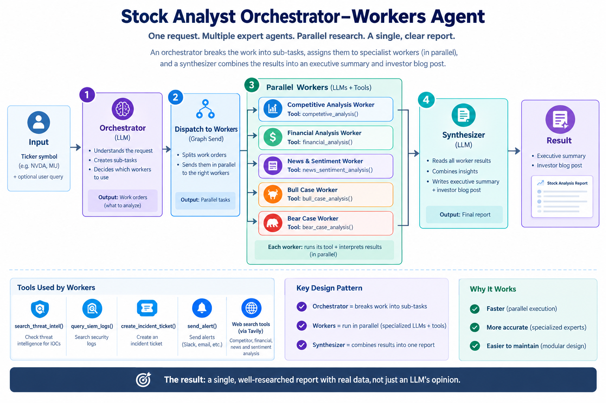

# Stock Analyst Orchestrator-Workers Agent

**One request. Multiple expert agents. Parallel research. A single, clear report.**

This is a production example of the **Worker-Orchestrator Pattern** from [Anthropic's Building Effective Agents](https://www.anthropic.com/engineering/building-effective-agents).

---

## How It Works



**Flow**: Ticker → Orchestrator creates work orders → Dispatch sends them to 5 parallel workers → Each worker runs its tool + interprets results → Synthesizer combines everything into a final report.

---

## What Each Node Does

### 1. **Orchestrator Node**
- **Input**: Ticker + optional user query
- **Job**: Break down the request into independent analysis tasks
- **Output**: List of work orders (which workers to run)
- **Example**: "Analyze NVDA bull case only" → creates 3 tasks (competitive, financial, bull case)

### 2. **Dispatch Layer**
- **Job**: Convert work orders into parallel LangGraph `Send()` objects
- **Result**: Each worker gets its own isolated state and runs concurrently
- **Speed Gain**: 5 workers × 10 seconds = 50 seconds serial → 10 seconds parallel = **5x faster**

### 3. **Worker Node** (`worker_node` — one graph node, run 5x in parallel)

There is only **one** worker node in the graph. LangGraph's `Send()` spawns 5 parallel *instances* of it — one per work order (Competitive, Financial, News, Bull, Bear). Each instance is isolated and runs this same function internally in 3 sub-steps:

1. **Call its tool** (deterministic data fetching)
   e.g. the Financial instance calls `financial_analysis(ticker)` → raw search results (JSON)

2. **Interpret the results with an LLM** ← *this is inside the same node, not a separate node*
   The raw JSON is passed to an LLM along with a role-specific system prompt (`WORKER_PROMPTS[worker_type]`), which turns it into 3-4 sentences of actual analysis:
   - Financial instance's LLM call extracts: revenue growth, margins, P/E ratio
   - Competitive instance's LLM call extracts: market share, rivals, advantages
   - Sentiment instance's LLM call extracts: overall tone, key themes, recent events

3. **Return its finding**
   Appends `{worker_type, findings}` to shared state (via `operator.add`) — no overwriting between the 5 parallel instances

So "tool call → LLM interpretation → return" all happens **inside a single `worker_node` execution**, not across multiple graph nodes.

### 4. **Fan-In Merge**
- LangGraph waits for all 5 workers to finish
- Combines all results into one list (automatically, no code needed)
- `operator.add` acts as the merger—prevents overwrites

### 5. **Synthesizer Node**
- **Input**: All 5 worker findings (pre-merged)
- **Job**: Read all findings, synthesize into final report
- **Output**: 
  - Executive summary (2-3 paragraphs for portfolio managers)
  - Investor blog post (5-7 paragraphs, detailed analysis)

---

## The 5 Tools (What Workers Use)

| Worker | Tool | What It Does |
|--------|------|--------------|
| **Competitive** | `competetive_analysis()` | Searches web for market share, competitors, positioning |
| **Financial** | `financial_analysis()` | Searches web for revenue, earnings, profit margins, P/E |
| **News** | `news_sentiment_analysis()` | Searches web for recent news, analyst views, sentiment |
| **Bull Case** | `bull_case_analysis()` | Searches web for growth catalysts, upside scenarios |
| **Bear Case** | `bear_case_analysis()` | Searches web for risks, threats, downside scenarios |

All tools use **Tavily Search API** to fetch real-time data.

---

## Why This Pattern Works

| Benefit | Why | Example |
|---------|-----|---------|
| **Fast** | Parallel execution | 5 workers × 10s = 50s serial → 10s parallel |
| **Accurate** | Specialized experts | Financial analyst vs sentiment analyst interpret differently |
| **Flexible** | Task-driven decomposition | "Bull case only" → runs 3 workers, not 5 |
| **Resilient** | One failure doesn't block others | If one search fails, others still complete |
| **Clear** | Modular design | Each component has one job |

---

## Quick Start

### Prerequisites
```bash
pip install langchain langchain-ollama langgraph tavily-python python-dotenv
```

### Setup
```bash
# Create .env file
TAVILY_API_KEY=your_tavily_api_key
```

### Run
```bash
python stocks.py
```

**Output**: Execution logs + Executive Summary + Investor Blog Post

---

## Customization

### Filter by User Query
```python
ticker = "NVDA"
user_query = "Bull case only"  # Only creates bull + supporting tasks

# vs.

user_query = ""  # Creates all 5 tasks
```

The orchestrator reads the query and decides which workers to use.

### Add New Worker
1. Create a new `@tool` in `tools.py`
2. Add to `TOOL_MAP` in `stocks.py`
3. Add specialist prompt to `WORKER_PROMPTS`
4. Orchestrator automatically recognizes it

---

## Files

- **stocks.py** (22KB): Main agent implementation
- **tools.py** (5KB): 5 data-fetching tools
- **README.md**: This guide
- **ARCHITECTURE.md**: Visual diagrams, execution timelines, state flow
- **TOOLS.md**: Detailed tool specifications

---

## Further Reading

- **Pattern Source**: [Anthropic's Building Effective Agents](https://www.anthropic.com/engineering/building-effective-agents)
- **LangGraph Docs**: https://langchain-ai.github.io/langgraph/
- **Fan-Out/Fan-In**: See ARCHITECTURE.md for detailed diagrams
- **State Management**: See ARCHITECTURE.md for state flow

---

## Key Insight

> **The orchestrator decides WHAT. The workers decide HOW. The synthesizer decides the narrative.**

This separation of concerns makes the system:
- Easy to debug (each component is isolated)
- Easy to extend (add workers without changing orchestrator)
- Easy to maintain (clean boundaries)
